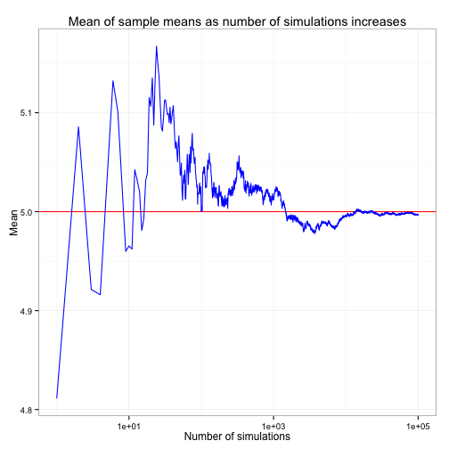
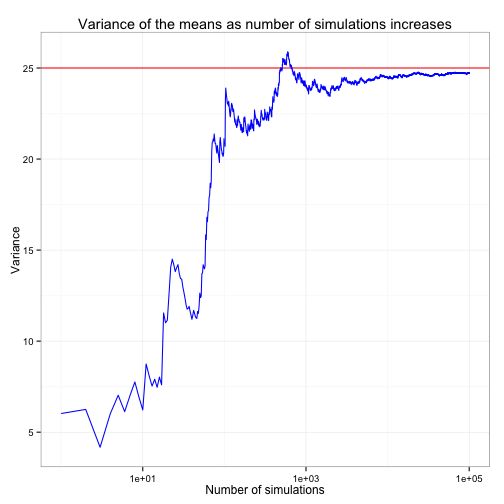

# Part 1

## Introduction

The first part of this project consists in investigating the exponential distribution in R and comparing it with the Central Limit Theroem. We will take many observations of samples of the exponential distribution and confirm that the distribution of the means of the samples converges to the normal distribution.

We will first calculate the theorical values and show the convergence of the mean and the variance. Finally, we will show that the distribution of the means converges to a normal distribution.

## The exponential distribution - theorical values

The exponential distribution has the following probability density function:

$$
f(x; \lambda) =\left\{\begin{matrix}
 &\lambda {e}^{-\lambda x} & x \geq 0\\
 & 0 & x < 0
\end{matrix}\right.
$$

For this exercise, we set $\lambda = 0.2$


```r
lambda <- 0.2
```


The expected value is:

$$
E[X] = \frac{1}{\lambda}
$$


```r
theoritical_mean <- 1/lambda
theoritical_mean
```

```
## [1] 5
```

And the variance is:

$$
Var [X] = \frac{1}{\lambda^{2}}
$$


```r
theoritical_var <- 1 / lambda^2
theoritical_var
```

```
## [1] 25
```

## Simulations

I will investigate the distribution of averages of 40 exponentials by simulating 100 000 distributions of 40 exponentials and storing their means and their variances to see if they converge to the theoritical values.


```r
set.seed(123)
nb_obs <- 100000
sample_means <- NULL
sample_vars <- NULL
for (i in 1 : nb_obs) {
    f <- rexp(40, lambda)
    sample_means <- c(sample_means, mean(f))
}
```

## Sample mean versus theoritical mean

This plot shows the mean of the sample means converging to the theoritical mean (in red) as the number of simulations increases:


```r
cum_means <- cumsum(sample_means) / (1:nb_obs)
g <- ggplot(data.frame(x=1:nb_obs, y=cum_means), aes(x=x, y=y))
g <- g + geom_hline(yintercept = theoritical_mean, color="red")
g <- g + geom_line(color="blue")
g <- g + labs(title = "Mean of sample means as number of simulations increases", x = "Number of simulations", y = "Mean")
g <- g + theme_bw()
g <- g + scale_x_log10()
g
```

 

## Sample variance versus theoritical variance

The Central Limit Theorem tells us that with enough observations, the standard deviation of the means of the samples can be approximated by the sampling standard error ($SE$).

$$
\sigma_{sample} \rightarrow SE = \sqrt{\frac{Var}{n}}
$$

In other words, we should see that with enough observations, the following should tend towards the theoritical variance:

$$
\sigma_{sample}^{2} \times n  \rightarrow Var
$$


```r
vars <- NULL
# we calculate the variance of the means, starting with the first 2 means
for (i in 2:nb_obs) {
    vars <- c(vars, sd(sample_means[1:i])^2 * 40)
}
g2 <- ggplot(data.frame(x=1:(nb_obs-1), y=vars), aes(x=x, y=y))
g2 <- g2 + geom_hline(yintercept = theoritical_var, color="red")
g2 <- g2 + geom_line(color="blue")
g2 <- g2 + labs(title = "Variance of the means as number of simulations increases", x = "Number of simulations", y = "Variance")
g2 <- g2 + theme_bw()
g2 <- g2 + scale_x_log10()
g2
```

 

## Distribution

The Central Limit Theorem also tells us that the distribution of the means of the samples should be approximately normal, given enough observations.

The normal distribution should be of the form $N(\mu , \sigma ^{2}/n)$.

To show this, let's draw the distribution of the means with different number of observations, along with the theoritical normal distribution:


```r
data <- NULL
# let's build the samples for 10, 100, 1000, 10000 and 100 000 observations
data <- rbind(
    data.frame(obs=10, x=sample_means[1:10]),
    data.frame(obs=100, x=sample_means[1:100]),
    data.frame(obs=1000, x=sample_means[1:1000]),
    data.frame(obs=10000, x=sample_means[1:10000]),
    data.frame(obs=100000, x=sample_means[1:100000])
    )
g3 <- ggplot(data, aes(x = x)) + geom_histogram(aes(y=..density..), binwidth=.05)
# plot normal distribution, with parameters as per the Central Limit Theorem
g3 <- g3 + stat_function(fun = dnorm, color="red", args=list(mean=5, sd=sqrt(theoritical_var / 40)))
# plot panel plots by number of observations
g3 <- g3 + facet_grid(. ~ obs)
g3
```

```
## Error: Results must be all atomic, or all data frames
```

We can see that with enough observations, the distribution of the means of the samples is close to the normal distribution as given by the Central Limit Theorem (in red).
