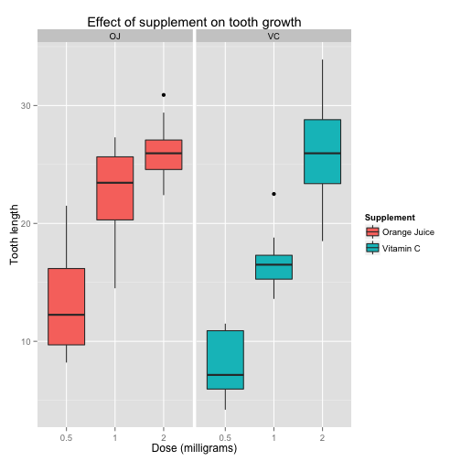

# Part 2

## Introduction

We will look at the dataset `ToothGrowth` which shows the response in the length of odontoblasts (teeth) in each of 10 guinea pigs at each of three dose levels of Vitamin C (0.5, 1, and 2 mg) with each of two delivery methods (orange juice or ascorbic acid).

## ToothGrowth preprocessing

First a quick look at the data:


```r
glimpse(ToothGrowth)
```

```
## Observations: 60
## Variables:
## $ len  (dbl) 4.2, 11.5, 7.3, 5.8, 6.4, 10.0, 11.2, 11.2, 5.2, 7.0, 16....
## $ supp (fctr) VC, VC, VC, VC, VC, VC, VC, VC, VC, VC, VC, VC, VC, VC, ...
## $ dose (dbl) 0.5, 0.5, 0.5, 0.5, 0.5, 0.5, 0.5, 0.5, 0.5, 0.5, 1.0, 1....
```

```r
summary(ToothGrowth)
```

```
##       len        supp         dose      
##  Min.   : 4.20   OJ:30   Min.   :0.500  
##  1st Qu.:13.07   VC:30   1st Qu.:0.500  
##  Median :19.25           Median :1.000  
##  Mean   :18.81           Mean   :1.167  
##  3rd Qu.:25.27           3rd Qu.:2.000  
##  Max.   :33.90           Max.   :2.000
```

```r
levels(ToothGrowth$supp)
```

```
## [1] "OJ" "VC"
```

```r
unique(ToothGrowth$dose)
```

```
## [1] 0.5 1.0 2.0
```

We can see that this dataset contains 60 observations on 3 variables :

* tooth length
* supplement type (VC or OJ, that we will reference as Vitamin C and Orange Juice in this document)
* dose in milligrams (0.5mg, 1mg or 2mg)

The dose can only take 3 values, so we can convert it to a factor:


```r
ToothGrowth$dose <- as.factor(ToothGrowth$dose)
```

Now the dataset is ready for further analysis.

## Toothgrowth exploratory analysis

An interesting view would be to display the relation between the tooth length and the dose for each supplement:


```r
g <- ggplot(ToothGrowth, aes(x = dose, y = len, fill = supp))
g <- g + geom_boxplot(aes(x = dose))
g <- g + labs(title="Effect of supplement on tooth growth", x="Dose (milligrams)", y="Tooth length")
g <- g + scale_fill_discrete(name="Supplement", labels=c('Orange Juice', 'Vitamin C'))
g <- g + facet_grid(. ~ supp)
g
```

 

We can draw the following observations from this plot:

* Vitamin C and Orange Juice seem to have a positive impact on teeth growth.
* at small dose level, it seems that Orange Juice has more impact.
* at high dose level, the impact seems to be similar.
* it seems that augmenting the dose level increases the teeth length.

## Statistical inference

Let's now look at the sample used to collect this data, and see if some assumptions we could draw by looking at the data are correct.

### Assumption 1 : The delivery method impacts the tooth growth

Let's first try to determin if the delivery method has an impact on the results. Let $H_{0}$ be the null hypothesis that it has no impact:

$$
H_{0} : \mu _{oj} = \mu _{vc}
$$

To compare the impact of each supplement, we can perform an independant group T test.


```r
oj <- ToothGrowth[ToothGrowth$supp == 'OJ',]$len
vc <- ToothGrowth[ToothGrowth$supp == 'VC',]$len
```

Let's look at the variance of the 2 groups:


```r
var(oj)
```

```
## [1] 43.63344
```

```r
var(vc)
```

```
## [1] 68.32723
```

The difference is not negligible, so we'll assume the 2 groups have unequal variances for the T test.


```r
t.test(oj, vc, paired=FALSE, var.equal=FALSE)
```

```
## 
## 	Welch Two Sample t-test
## 
## data:  oj and vc
## t = 1.9153, df = 55.309, p-value = 0.06063
## alternative hypothesis: true difference in means is not equal to 0
## 95 percent confidence interval:
##  -0.1710156  7.5710156
## sample estimates:
## mean of x mean of y 
##  20.66333  16.96333
```

The 95% confidence interval `[-0.1710156  7.5710156]` contains 0, which means that we can not really tell with this sample if the delivery method is relevant to the impact.

The P-value is `0.06063` which is too high at a significant level of 5%, we can't exclude our null hypothesis $H_{0}$, so it's possible, given this sample, that the delivery method has no effect on the teeth growth.

*Conclusion: the delivery method has no proven impact on the teeth growth.*

### Assumption 2 : The dose level impacts the tooth growth

Now we can test if the dose level has an impact on the results. We will test the impact of 1mg versus 0.5mg, and 2mg versus 1mg.

#### Assumption 2.1 : Increasing the dose level from 0.5mg to 1mg impacts the result

Our null hypothesis $H_{0}$ is that increasing the dose level has no impact:

$$
H_{0} : \mu_{0.5mg} = \mu_{1mg}
$$

Let's do another independant group T test. The two groups we are looking at are no the ones who got 0.5mg versus those who got 1mg.


```r
mg05 <- ToothGrowth[ToothGrowth$dose == 0.5,]$len
mg10 <- ToothGrowth[ToothGrowth$dose == 1.0,]$len
```

Let's calculate the variances:


```r
var(mg05)
```

```
## [1] 20.24787
```

```r
var(mg10)
```

```
## [1] 19.49608
```

The variance are relatively similar, we can assume equality of variance.


```r
t.test(mg05, mg10, paired=FALSE, var.equal=TRUE)
```

```
## 
## 	Two Sample t-test
## 
## data:  mg05 and mg10
## t = -6.4766, df = 38, p-value = 1.266e-07
## alternative hypothesis: true difference in means is not equal to 0
## 95 percent confidence interval:
##  -11.983748  -6.276252
## sample estimates:
## mean of x mean of y 
##    10.605    19.735
```

The P-value is almost 0, this means that we can reject the null hypothesis that the dose level increase between 0.5mg and 1mg has no impact. Similarely, the 95% confidence doesn't include 0, so there is more than 95% chance that the dose level impacts the results.

*Conclusion: increasing the dose level from 0.5mg to 1mg has an impact on the teeth growth with 95% confidence.*


#### Assumption 2.2 : Increasing the dose level from 1mg to 2mg impacts the result

Our null hypothesis $H_{0}$ is that increasing the dose level from 1mg to 2mg has no impact:

$$
H_{0} : \mu_{1mg} = \mu_{2mg}
$$

Let's do another independant group T test. The two groups we are looking at are no the ones who got 2mg versus those who got 1mg (we already extracted thenm in the previous analysis).


```r
mg20 <- ToothGrowth[ToothGrowth$dose == 2.0,]$len
```

Let's calculate the variances:


```r
var(mg10)
```

```
## [1] 19.49608
```

```r
var(mg20)
```

```
## [1] 14.24421
```

The variance are not similar, we will assume unequality of variance.


```r
t.test(mg10, mg20, paired=FALSE, var.equal=FALSE)
```

```
## 
## 	Welch Two Sample t-test
## 
## data:  mg10 and mg20
## t = -4.9005, df = 37.101, p-value = 1.906e-05
## alternative hypothesis: true difference in means is not equal to 0
## 95 percent confidence interval:
##  -8.996481 -3.733519
## sample estimates:
## mean of x mean of y 
##    19.735    26.100
```

The P-value is almost 0, this means that we can reject the null hypothesis that the dose level increase between 0.5mg and 1mg has no impact. Similarely, the 95% confidence doesn't include 0, so there is more than 95% chance that the dose level impacts the results.

*Conclusion: increasing the dosis from 1mg to 2mg has an impact on the teeth growth with 95% confidence.*

## Conclusions

To summarize the result of the 3 T-tests performed on the given sample:

*  the delivery method has no proven impact on the teeth growth.
*  increasing the dose level from 0.5mg to 1mg has an impact on the teeth growth.
*  increasing the dose level from 1mg to 2mg has an impact on the teeth growth.

## Assumptions

* the Guinea pigs are randomly assigned to the groups receiving the Vitamin C or the Orange Juice.
* the Guinea pigs choosen for the sample are representative of the population of the Guinea pigs.
